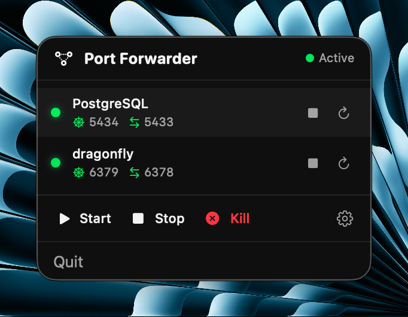

# PortForwarder

> [!IMPORTANT]
> ## This project has been moved to [port-killer](https://github.com/productdevbook/port-killer)
>
> All features from this repository have been merged into port-killer. Please use the new repository for:
> - Latest releases and updates
> - Bug reports and feature requests
> - Contributing
>
> **This repository is now archived and no longer maintained.**

---

[](LICENSE)
[](https://www.apple.com/macos/)
[](https://swift.org)
[](https://github.com/productdevbook/port-forwarder/releases)

A native macOS menu bar application for managing Kubernetes port-forward connections with optional socat proxy support for multiple simultaneous connections.

<p align="center">
  
</p>

## Features

- **Menu Bar Integration** - Lives in your menu bar, no Dock icon clutter
- **kubectl port-forward Management** - Start, stop, and monitor connections
- **socat Proxy Support** - Enable multiple simultaneous connections to the same port-forward
- **Auto-Reconnect** - Automatically reconnects when connections drop
- **Dependency Management** - Automatically installs missing dependencies via Homebrew
- **Native Notifications** - Get notified about connection status changes
- **Service Browser** - Browse and connect to Kubernetes services directly

## Requirements

- macOS 15.0+ (Sequoia)
- [kubectl](https://kubernetes.io/docs/tasks/tools/) (auto-installed via Homebrew if missing)
- [socat](http://www.dest-unreach.org/socat/) (optional, for proxy support - auto-installed via Homebrew)

## Installation

### Download (Recommended)

Download the latest DMG from [GitHub Releases](https://github.com/productdevbook/port-forwarder/releases):

1. Download `PortForwarder-vX.X.X-arm64.dmg`
2. Open the DMG file
3. Drag PortForwarder to your Applications folder
4. **First launch:** Right-click the app → Select "Open" → Click "Open" in the dialog
5. After that, launch normally from Applications or Spotlight

> **Note:** The app is ad-hoc signed. On first launch, macOS Gatekeeper will show a warning. Right-click and select "Open" to bypass this. This only needs to be done once.

> **Note:** Currently only Apple Silicon (M1/M2/M3/M4) Macs are supported.

### Build from Source

```bash
# Clone the repository
git clone https://github.com/productdevbook/port-forwarder.git
cd port-forwarder

# Build the app bundle
./scripts/build-app.sh

# Copy to Applications
cp -r .build/release/PortForwarder.app /Applications/

# Launch
open /Applications/PortForwarder.app
```

The build script automatically:
- Creates a release build
- Generates the `.app` bundle
- Applies ad-hoc code signing (required for notification permissions)

### Alternative: Run Directly

```bash
swift run
```

> **Note:** Running with `swift run` won't support notifications as macOS requires a signed `.app` bundle for notification permissions.

## Usage

1. Click the network icon in the menu bar
2. Use "Start All" to connect all configured connections
3. Open Settings to add, edit, or remove connections

### Connection Architecture

```
┌─────────┐     ┌─────────────────┐     ┌──────────────────────┐     ┌────────────────┐
│  App 1  │─┐   │                 │     │                      │     │                │
├─────────┤ │   │  socat proxy    │     │  kubectl port-forward│     │  K8s Service   │
│  App 2  │─┼──▶│  (optional)     │────▶│                      │────▶│                │
├─────────┤ │   │  localhost:5433 │     │  localhost:5434      │     │  port 5432     │
│  App 3  │─┘   │                 │     │                      │     │                │
└─────────┘     └─────────────────┘     └──────────────────────┘     └────────────────┘
```

### Why socat Proxy?

kubectl port-forward only supports a single connection at a time. With socat proxy:
- Multiple applications can connect simultaneously
- Connection drops don't affect other clients
- Better stability for development workflows

## Configuration

### Adding a Connection

1. Open Settings from the menu bar
2. Click "+" to add a new connection
3. Configure:
   - **Name** - Display name for the connection
   - **Namespace** - Kubernetes namespace
   - **Service** - Service name to forward
   - **Local Port** - Port on your machine (kubectl)
   - **Remote Port** - Port on the Kubernetes service
   - **Proxy Port** (optional) - socat proxy port for multiple connections

### Configuration File

Settings are stored at:
```
~/Library/Application Support/PortForwarder/connections.json
```

## Development

```bash
# Debug build
swift build

# Release build
swift build -c release

# Open in Xcode
open Package.swift
```

### Project Structure

```
Sources/
├── PortForwarderApp.swift    # App entry point
├── Managers/                 # Core business logic
│   ├── ConnectionManager.swift
│   ├── ProcessManager.swift
│   └── ...
├── Models/                   # Data structures
│   └── ConnectionConfig.swift
└── Views/                    # SwiftUI views
    ├── MenuBarView.swift
    └── SettingsView.swift
```

## Contributing

Contributions are welcome! Please read our [Contributing Guidelines](CONTRIBUTING.md) before submitting a Pull Request.

## License

This project is licensed under the MIT License - see the [LICENSE](LICENSE) file for details.
